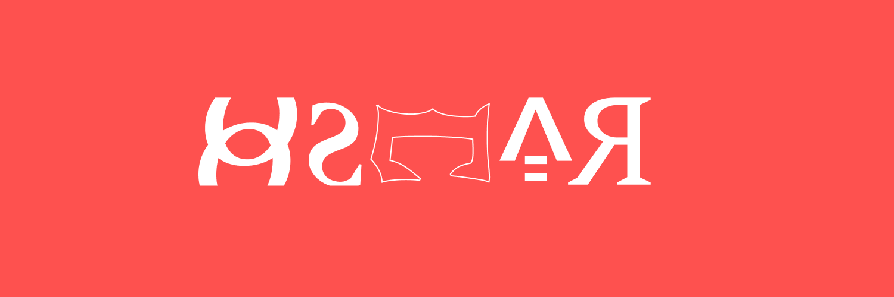

  
  
  

Hi there,

I am Oscar. A mobile developer, UI/UX designer and content writer. I am technologically driven and I make it a mission to provide innovative pixel perfect works and designs. Want to know more about me, click on any of the available links below.

# Team's Latest Blog Posts
 
<!-- BLOG-POST-LIST:START -->
- [Becoming A Better Programmer](https://crasonn.hashnode.dev/becoming-a-better-programmer)
- [Understanding Css Positioning](https://crasonn.hashnode.dev/understanding-css-positioning)
- [What  is programming?](https://crasonn.hashnode.dev/what-is-programming)
- [Common Errors Beginners Make While Learning Javascript](https://crasonn.hashnode.dev/common-errors-beginners-make-while-learning-javascript)
- [Choosing A Career Path In Tech](https://crasonn.hashnode.dev/choosing-a-career-path-in-tech)
<!-- BLOG-POST-LIST:END --> 
 

# 💼 Skills

  

 

More Skills

 
 
...something cooking in the cloud

